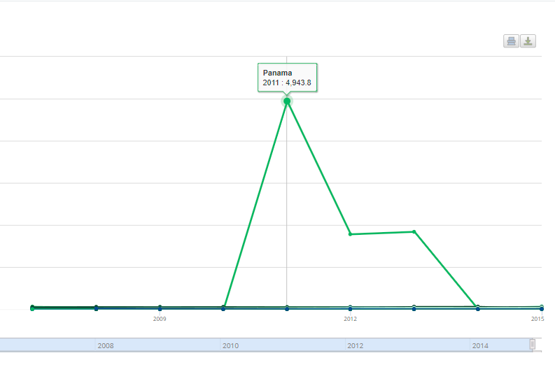
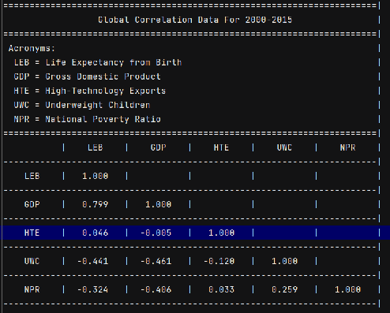

#### SERX94: Exploratory Data Munging and Visualization
#### Do People in Wealthier Countries Live Longer? (Working Title)
#### John S. Garvey
#### 10/18/2023

## Basic Questions
**Dataset Author(s):** www.worldbank.org

**Dataset Construction Date:** 2015

**Dataset Record Count:** 217 Countries

**Dataset Field Meanings:**
 - Series Name—The world development indicator
 - Series Code—The world development indicator ID code
 - Country Name—Name of country data was recorded from
 - Country Code—Abbreviation for name of country data was recorded from
 - 2000 [YR2000]- Data collected from the year 2000 
 - 2001 [YR2001]- Data collected from the year 2001 
 - 2002 [YR2002]- Data collected from the year 2002 
 - 2003 [YR2003]- Data collected from the year 2003 
 - 2004 [YR2004]- Data collected from the year 2004 
 - 2005 [YR2005]- Data collected from the year 2005 
 - 2006 [YR2006]- Data collected from the year 2006 
 - 2007 [YR2007]- Data collected from the year 2007 
 - 2008 [YR2008]- Data collected from the year 2008 
 - 2009 [YR2009]- Data collected from the year 2009 
 - 2010 [YR2010]- Data collected from the year 2010 
 - 2011 [YR2011]- Data collected from the year 2011 
 - 2012 [YR2012]- Data collected from the year 2012 
 - 2013 [YR2013]- Data collected from the year 2013 
 - 2014 [YR2014]- Data collected from the year 2014 
 - 2015 [YR2015]- Data collected from the year 2015 

**Dataset File Hash(es):** 
URL: https://databank.worldbank.org/indicator/NY.GDP.PCAP.CD/1ff4a498/Popular-Indicators#
MD5 Hash: 13006a515bee27b5a21a8a5672980bc5

## Interpretable Records
### Record 1
**Raw Data:** 
 - "Life expectancy at birth, total (years)",
 - SP.DYN.LE00.IN,
 - United States,
 - USA,
 - 76.6365853658537,
 - 76.8365853658537,
 - 76.9365853658537,
 - 77.0365853658537,
 - 77.4878048780488,
 - 77.4878048780488,
 - 77.6878048780488,
 - 77.9878048780488,
 - 78.0390243902439,
 - 78.390243902439,
 - 78.5414634146342,
 - 78.6414634146341,
 - 78.7414634146342,
 - 78.7414634146342,
 - 78.8414634146341,
 - 78.690243902439

Interpretation:** This data is reasonable for the dataset. This is the life expectancy for the USA for the years of 2000 
to 2015. The data seems sound because the USA's life expectancy has held steady at almost 80 years old for a while.

### Record 2
**Raw Data:** 
 - GDP per capita (current US$),
 - NY.GDP.PCAP.CD,
 - Luxembourg,
 - LUX,
 - 48659.5988753233,
 - 48440.1420151355,
 - 53005.7339209179,
 - 65689.3214536911,
 - 76544.9170868473,
 - 80988.1376230858,
 - 90788.8004876145,
 - 107475.320297978,
 - 120422.137934157,
 - 109419.746953106,
 - 110885.991378724,
 - 119025.057203467,
 - 112584.676270958,
 - 120000.14072986,
 - 123678.702143273,
 - 105462.012584423

**Interpretation:** We can see from this data that Luxembourg's GDP per capita has rocketed into one of the
largest in the world. This data may not seem reasonable, but it actually is. Luxembourg has had one of the fastest 
growing and highest GDP per capita rates for any country on earth in recent years.

## Background Domain Knowledge

- Life Expectancy, Development Indicators, Prosperity,

- Developed Nations: Abundance, Modern Technology, Wealthy, 

- Developing Nations: Scarcity, Distressed, Poverty

For this project, we will draw upon the extensive dataset available at www.worldbank.org. The datasets under consideration 
are collected from all countries worldwide, spanning the years 2000 to 2015. These datasets consist of 
prominent world development indicators, which we intend to investigate with exploratory data analysis. 
The key indicators we will be examining are as follows:

- Life Expectancy from Birth
- Gross Domestic Product per capita
- Percentage of Higher-Technology Exports
- Population Ratio below National Poverty Lines
- Prevalence of Underweight Children

Our primary emphasis is on contemporary life expectancy rates, with a specific focus on discerning the factors that 
potentially contribute to a higher life span. The main question we seek to answer is as follows: "Does living in a wealthy 
nation translate to a longer life?" Our investigation is primarily concerned with life expectancy and not actual quality of life. 
Instead, we can reframe the question to be simply as follows: "Are those living in abundance healthier?" 

For the purposes of this project, we will using a simplistic categorization of countries based on their levels of prosperity. 
We will adopt the terminology employed by The World Bank, distinguishing between "developed" and "developing" 
nations or countries. Our analysis acknowledges that this classification represents a spectrum, with countries falling 
anywhere between the two ends. The conceptual essence of "developed" and "developing" nations, as employed in this study, 
is briefly outlined above. We consider developed countries to be those characterized by abundance, affluence, and access 
to modern technology, while developing countries are characterized by scarcity, limited access to resources, including 
technology, and are experiencing distressed or impoverished economic circumstances.

This project stems from a series of questions and discussions that come from my own life, interests, limited personal experience, 
and research, but which I believe possess intellectual merit for investigating factors influencing life expectancy in the twenty-first 
century. The objective of this project is to gain evidence to support one of two opposing hypotheses. On one hand, the citizens living 
in a developed nation are likely to be healthy because they have no shortage of resources like food or supplies, along with 
access to modern medical treatments and technologies that help keep them alive when they get sick or hurt. 
Conversely, individuals that live in societies of over-abundance tend to suffer from health issues such as addiction and obesity, 
as evidenced by heart disease consistently ranked as the leading cause of death in the USA [1].

On the other hand, individuals in developing nations obviously tend to have limited access to vital resources such as food and 
medicine which affect their populations' health considerably. Another depressing fact is the persistence of tuberculosis 
as one of the top 10 leading causes of death worldwide [3], despite being curable since the 1940s [2]. This inequitably 
leads to the lack of access to tuberculosis medication meaning that, " In the 95% of all cases, 99% of deaths occur in developing 
countries, with the greatest burden in Sub-Saharan Africa and Southeast Asia"[4] This situation implies that citizens 
who are ill or injured in developing countries have a greater chance of not being able to get the help they need. However, 
societies not classified as "developed" are not necessarily less healthy. In fact, for those still living in predominantly agrarian 
societies "the major chronic diseases have low prevalence among the rural peasantry and tribal groups, with the exception of 
gastro-esophageal cancer, osteoarthritis and cataracts."[5]

Given these two opposing hypotheses, the central aim of this project is to collect evidence that can address the question
of whether living in a developed country is indeed associated with a longer life.

Works Cited:

[1] https://www.cdc.gov/nchs/fastats/leading-causes-of-death.htm

[2] https://erj.ersjournals.com/content/20/36_suppl/87S#:~:text=The%20major%20historical%20landmarks%20of,in%20the%201970s%20that%20isoniazid

[3] https://www.international.gc.ca/world-monde/issues_development-enjeux_developpement/global_health-sante_mondiale/tuberculosis-tuberculose.aspx?lang=eng

[4] https://mpra.ub.uni-muenchen.de/82851/

[5] https://pubmed.ncbi.nlm.nih.gov/24398278/

[6] https://www.who.int/data/gho/data/themes/mortality-and-global-health-estimates/ghe-life-expectancy-and-healthy-life-expectancy

[7] https://en.wikipedia.org/wiki/List_of_countries_by_life_expectancy

## Data Transformation
### Transformation 1
**Description:** Filtering
- Removed non-relevant data fields such as Series Name and Series Code

**Soundness Justification:** 
This is just the category or indicator name and system code for the database found at The World Bank.

### Transformation 2
**Description:** Filtering
- Removed non-relevant rows (or categories / indicators)

**Soundness Justification:** The dataset we are using is the preset dataset Popular World Development Indicators which 
contains alot more indicators than the ones we are focused on.

### Transformation 3
**Description:** Standardization
- Commas in Country Name dealt with
**Soundness Justification:** This was when dealing with splicing the data into their own processed data .csv files some names
contain commas in them. Basically, some country names contain commas in them that made them format incorrectly when parsing 
them from and into their own CSV files. Like for the Koreas there is both "Korea, Dem. People's Rep." and "Korea, Rep.". 
So for our processed data we just add commas to the start and end of all country names making the commas not an issue.

### Transformation 4
**Description:** Smoothing,
- Removed outlier Panama from the High-technology exports (% of manufactured exports) dataset. So I chose to remove the data for
the country of Panama in the tech_expo processed dataset. This dataset is in general problematic but this one record is def
either entered incorrectly or converted wrong because the values make no sense. They start off ok but then in 2012 it
shows the the percentage of Panama's exports skyrockets to 4,943% which is crazy and impossible. 

Outlier Record: 
"Panama",PAN,..,..,..,..,..,..,..,..,1.23425756445026,1.37390946639255,0.826039249213509,4943.8109921073,1779.82547013401,1837.94381898452,0.195655792189705,0.000467295873914452

Graph of High-technology exports (% of manufactured exports)   

**Soundness Justification:** Instead of performing imputation, it was decided to just remove this data from the visualization
process and calculation but not from the actual original datasets. The reason we decided to remove this data is because
this category or indicator only has 150 countries worth of data collected so the sample size is already very small. Meaning 
any values that would be entered instead would have a non-insignificant impact on the overall data. So if we were going to 
replace the data it would require that the replacement data be very accurate. So instead of spending the time find accurate 
information on the percentage of higher-technologies in the net exports of the country of Panama which would probably not 
be easy it was just removed from the calculations.

## Visualization
### Visual 1
[correlations.txt](data_processed%2Fcorrelations.txt)

**Analysis:** This first visual is the correlation matrix created to show the correlaions between development indicators.
From this table we can see that the category with strongest correlation is life expectancy and gdp per capita.

### Visual 2

**Analysis:** This is the scatter plot of each country's mean GDP per capita for the years 2000-2015 by the same countries
mean life expectancy for the same years. This scatter plots shows the strong positve correlation we calculated earlier.

### Visual 3

**Analysis:** The second-strongest correlation is between GDP and percentage of underweight children. This scatter plot show
this negative correlation is not as strong as the one above.

### Visual 4

**Analysis:** The third-strongest correlation is between life expectancy and percentage of underweight children. This scatter
plot show this negative correlation. This graph and the first one are very relevant to our project.

### Visual 5

**Analysis:** This is the qualitative histogram which shows the sample sizes for each category or popular world development 
indicator. The max number of countries in the datasets is 217 so both LEB, and GDP are almost complete. But the UWC, and 
NPR indicator records are much smaller. This may mean we should switch these indicators for some other more complete indicator
record set. Though UWC is useful for our analysis even though it is smaller.

## Full Disclosures
In the interest of full disclosure, this project is probably going to change again. This time not much though. Basically,  
the dataset I am working off of is a predefined dataset on The World Banks website that only goes back to the year 2000.
It wasn't till yesterday that I figure out how to use their website and noticed that I can extend the records all the way 
back to the 1960s. Which would be much more useful for our analysis of life expectancy correlations. So my next step will be
to add the records going back to the 60's. However, there is alot less data past the 2000's and almost none past the 1980's.

Also, I plan on changing some of the data categories or indicators. Mainly, the Population Ratio below National Poverty Lines 
dataset because the sample size is so small and the Percentage of Higher-Technology Exports dataset because the data seems 
very unreliable. But serious you should check out the World Bank database its kind of awesome! 
https://databank.worldbank.org/source/world-development-indicators#

